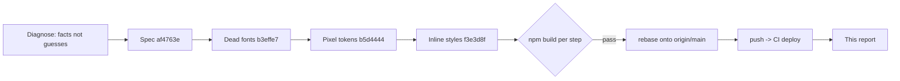

## 🧹 Legacy UI Hygiene Cleanup — Implementation Report

Modernization pass focused on **converging ad-hoc styling onto project standard tokens**, executed as a sequence of small, independently verifiable commits. Each step was gated on `prettier -> npm run build` and only landed after a clean compile.

### 📊 Summary

| Metric | Value |
| --- | --- |
| Commits | 4 (1 design spec + 3 refactors) |
| Files changed | 78 |
| Diff | +292 / -211 |
| Build | Compiled successfully (verified per step) |
| Baseline | `61710ad` (v0.1.39) -> `f3e3d8f` |

### 🔧 What changed

**1. Dead font classes removed (`b3effe7`, 42 files)**
- `font-pretendard-{medium,semibold,bold}` (121 occurrences) were **not defined** in `tailwind.config` or `globals.css` — silently dropped by Tailwind, so font weights never applied.
- Replaced 1:1 with the project's real utility classes defined in `globals.css`:
  - `font-pretendard-medium` -> `font-suit-medium`
  - `font-pretendard-semibold` -> `font-suit-semibold`
  - `font-pretendard-bold` -> `font-suit-bold`
- Effect: text-weight hierarchy is restored across the app.

**2. Pixel hardcoding tokenized (`b5d4444`, 38 files)**
- Arbitrary-value pixels that map exactly onto the Tailwind 4px scale were converted to standard utilities: `rounded-[8px]->rounded-lg`, `gap-[4px]->gap-1`, `ml-[8px]->ml-2`, `gap-[10px]->gap-2.5`, etc.
- **Deliberately preserved** `max-w-[640px]` — it is the project's sanctioned mobile-container standard (documented in `CLAUDE.md`) and already centers the layout on desktop. Touching it would be a visual change requiring human review.

**3. Static inline styles removed (`f3e3d8f`, 2 files)**
- `style={{ cursor: "pointer" }}` -> `className="cursor-pointer"`.
- Dynamically computed inline styles (e.g. `gridTemplateColumns`, variable-driven sizes) were **intentionally left untouched** — they are not statically replaceable.

### ✅ Verification

```
font-pretendard remaining : 0 files
rounded-[8px]  remaining   : 0
font-suit-* usages         : 161
npm run build              : Compiled successfully (BUILD_EXIT=0)
```

A post-rebase rebuild was also run after rebasing onto `origin/main` (v0.1.39 version bump) to confirm no regression before push.

### 🚧 Deliberately deferred (follow-up)

These were scoped out of this pass **on purpose** — they carry visual or wide-blast-radius risk that should be validated interactively rather than landed unattended:

- **Responsive (PC/mobile) transition** — only 6 files currently use `sm:/md:/lg:`. This is a visual change that a build cannot validate; needs design review.
- **Structure refactor** — type files (25, inconsistent naming), two hook folders (`hooks` + `global/hook`), mixed `global/` (store/util/firebase), Redux slice naming. These touch import paths broadly; safer to do in a dedicated, reviewed PR.

Design spec for the full plan: `docs/superpowers/specs/2026-06-17-malsami-fe-modernization-design.md`

### 🔁 Flow


